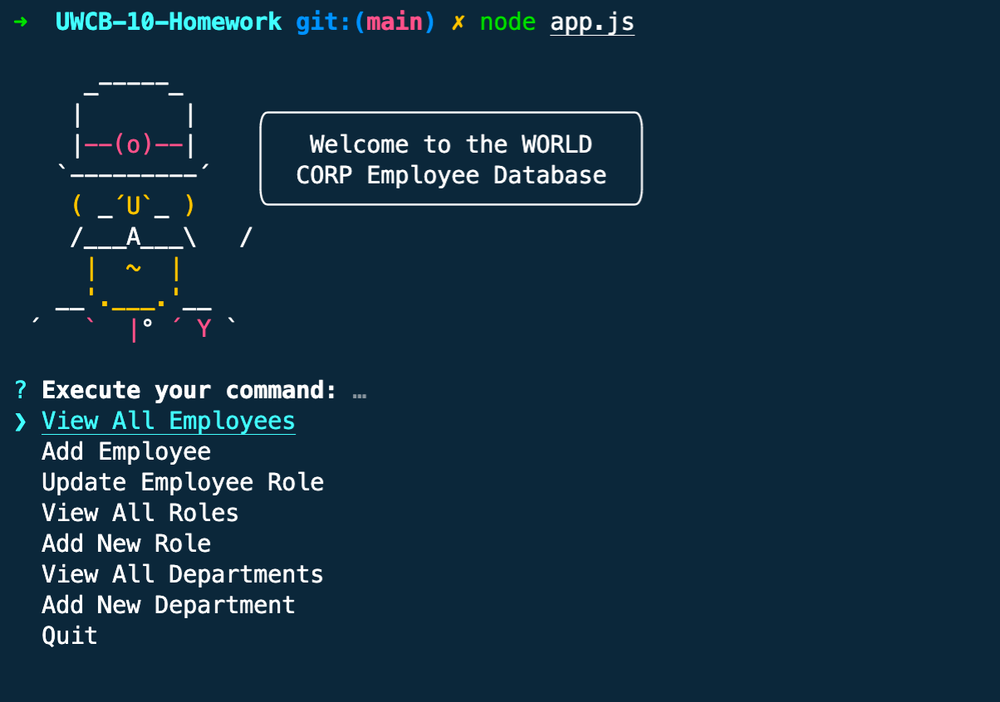

# Employee Tracker

UW Coding Bootcamp : Homework 10

## Description

A Node CLI app for viewing/adding/editing data in the WORLD CORP Employee Database. Codebase uses Enquirer, Postgres, Sequelize, Yosay, and ESLint.

## Preview

## Video Walkthrough

Watch the app in action by watching this <a href="https://www.loom.com/share/0f165586d7074c439dffa132218a008e">video walkthrough</a>
